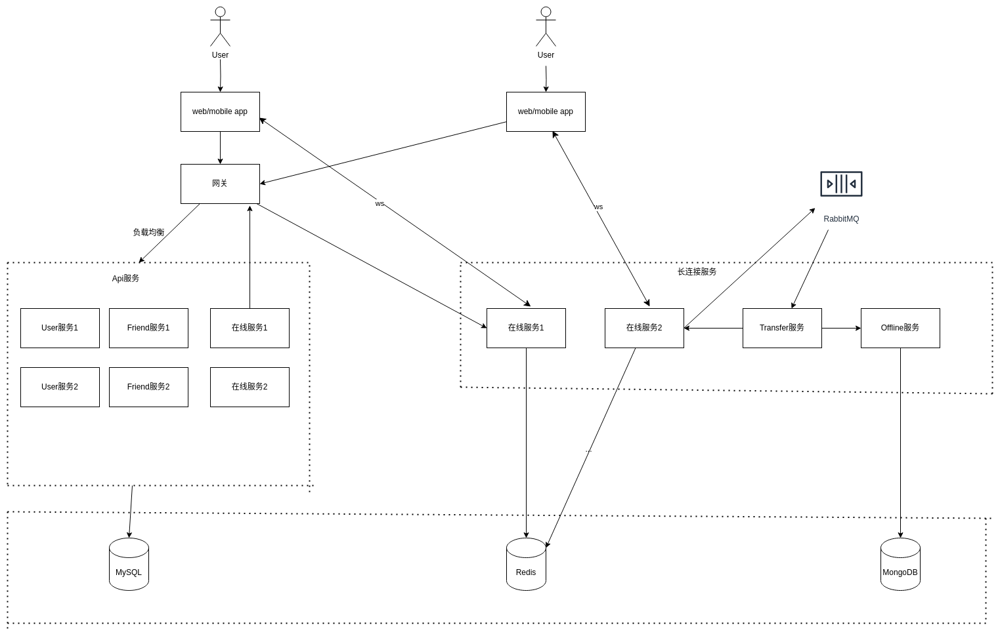

一个IM的DEMO，实现了IM的基本功能，如好友添加，群功能和消息收发，支持文本、图片、语音等消息

## 界面

## 架构

* 在线服务，负责用户连接管理，消息收发，是消息队列中的生产者
* Transfer转发服务，从消息队列消费并处理消息，之后调用在线服务发送消息或者调用离线服务
* Offline离线服务，负责存储离线消息

## 技术栈

* 前端：vue+组件库quaur
* gin：协议转换和权限验证
* rabbitmq 消息中转
* MySQL：用户、好友等数据
* MongoDB：离线数据
* redis：在线数据缓存

前端项目地址：https://github.com/adnpa/im-web

部署：docker compose
